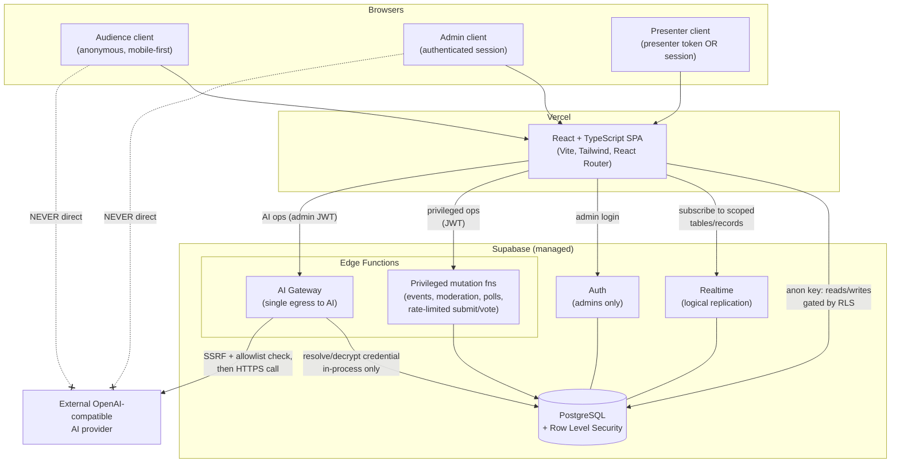
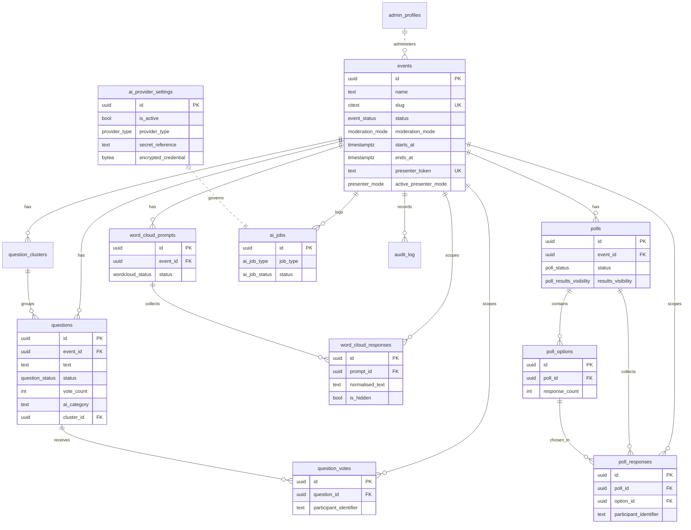

# Design Document: MSS LivePulse

## Overview

MSS LivePulse is an AI-native, web-based audience engagement platform for internal
events (~200–500 participants) that supports anonymous live Q&A, question upvoting,
single-choice polls, and word clouds, plus a projector-optimised presenter view and an
administrator dashboard. This document defines the technical design that satisfies the
27 requirements in `requirements.md`.

The design is built on three non-negotiable principles derived from the requirements:

1. **The core event flow is fully AI-independent.** Event creation, participant join,
   question/poll/word-cloud submission, moderation, voting, presenter control,
   analytics, and CSV export all operate with no AI service configured (Req 19.1,
   27.4, 27.6). AI enhancements (categorisation, clustering, theme insights, end-of-event
   summary) are strictly optional and sit *outside* the critical write path.
2. **Security is enforced in the database via Row Level Security (RLS), not only in the
   UI.** Anonymous users may only read/write data for an active event; all administrator
   mutations flow through authenticated policies or server-side Edge Functions (Req 21.3,
   21.5, 21.6, 10). RLS is enabled on 100% of client-exposed tables (Req 21.3).
3. **All AI calls are routed through a single server-side AI Gateway** (a Supabase Edge
   Function). The browser never contacts an AI provider directly (Req 11, 13, 14, 20).
   AI credentials are write-only secrets, SSRF-protected, and never returned to clients
   or written to logs (Req 12, 13, 20).

**High-level fit against the requirements:**

| Capability | Primary Requirements | Design element |
| --- | --- | --- |
| Event lifecycle (draft/live/ended/archived) | Req 1, 25 | `events` table + status enum, Edge Function mutations, RLS gating |
| Anonymous join + participant identity | Req 2, 24 | `participant_identifier` in `localStorage` w/ session fallback |
| Live Q&A + moderation | Req 3, 15, 16 | `questions` table, moderation modes, RLS visibility |
| Voting w/ realtime | Req 4, 23 | `question_votes` unique constraint, Realtime, RPC increment |
| Polls | Req 5, 22 | `polls` / `poll_options` / `poll_responses`, single-open constraint |
| Word cloud | Req 6, 22 | `word_cloud_prompts` / `word_cloud_responses`, normalisation |
| Presenter view | Req 7, 25 | token/session gated route, realtime presenter mode |
| Analytics | Req 8 | aggregation queries over indexed columns |
| Export (CSV + Markdown) | Req 9, 18 | Edge Function generators |
| Roles / authorisation | Req 10, 25 | Supabase Auth for admins, anonymous audience, presenter token |
| AI provider config + credential protection | Req 11, 12, 13 | `ai_provider_settings`, AI Gateway, secret reference / AEAD fallback |
| AI structured output + features | Req 14–18 | schema-validated adapters, prompt-based clustering |
| AI failure / degraded mode | Req 19, 27 | bounded retries, no critical-path dependency |
| Realtime / performance / reliability | Req 23 | scoped subscriptions, indexes, backoff, idempotency |
| Accessibility / UX | Req 24 | mobile-first, WCAG contrast, non-colour status |
| Testing + load validation | Req 26 | Vitest, fast-check, Playwright, k6 |
| Scope boundaries | Req 27 | excluded-capability rejection |

The remainder of this document details architecture, technology choices, the frontend,
the data model and RLS, the AI Gateway, correctness properties, error handling, testing,
deployment, and key design decisions.

---

## Architecture

MSS LivePulse is a **serverless, operationally simple** system: a single React SPA hosted
on Vercel, backed entirely by Supabase managed services (PostgreSQL with RLS, Realtime,
Auth, and Edge Functions). There is no separate custom backend; privileged server-side
logic lives in Supabase Edge Functions (Req: serverless & operationally simple). A custom
backend would only be introduced if the configured AI endpoint were unreachable from Edge
Functions — an explicitly avoided path for the MVP.

### System context



**Key invariant shown in the diagram:** browsers never call the AI provider directly
(Req 11, 20.1). The AI Gateway is the *only* egress point to any AI provider, and it is
the only component that resolves or decrypts credentials (Req 12.7).

### Component responsibilities

- **React SPA (Vercel):** Renders all role-specific UIs. Talks to Supabase directly using
  the anon key for RLS-gated reads/writes and Realtime subscriptions. Calls Edge Functions
  for privileged operations (admin mutations, rate-limited anonymous submit/vote, and all
  AI operations). No secret material is embedded in client code (Req 21.8).
- **PostgreSQL + RLS:** System of record. RLS policies are the primary security boundary
  (Req 21.3–21.7). Uniqueness constraints enforce one-vote/one-response invariants at the
  DB layer (Req 4.3, 5.8, 6.9). Indexes support realtime and analytics performance
  (Req 23.3).
- **Realtime:** Pushes scoped table/record changes to subscribed clients within 2 s
  (Req 4.7, 5.12, 6.15, 7.6, 23.1). Subscriptions are narrow — only the tables/records for
  the active view (Req 23.2).
- **Auth:** Authenticates administrators/moderators only (Req 10). Audience is anonymous;
  presenter uses a token or an authenticated session (Req 7.2, 7.3).
- **Edge Functions — privileged mutations:** Execute admin-only writes and event-status
  transitions with the service role behind an authenticated JWT check (Req 21.6). Also host
  server-side rate limiting for anonymous submit/vote (Req 21.13–21.15) via RPC or Edge
  Function.
- **AI Gateway Edge Function:** Provider-agnostic abstraction for all AI calls with SSRF
  protection, credential resolution, structured-output validation, retries, and sanitised
  results (Req 11–20).

### Request / data flows

**1. Audience join (Req 2, 25.1–25.3).**
Client resolves an event by slug/URL/QR → reads `events` row via RLS (only visible if
status is live). If no `participant_identifier` exists in `localStorage`, the client
generates one (≥128 bits entropy) and stores it; on storage failure it falls back to a
session-scoped identifier (Req 2.3, 2.4, 2.7). If the event is not live, participation
controls are withheld and the current status is shown (Req 2.8, 1.9).

**2. Question submit + moderation (Req 3, 15).**
Client submits question text (1–300 chars) through the rate-limited submit Edge Function /
RPC (Req 21.13). The function validates length/sanitisation (Req 21.9–21.11), then inserts
with status `pending` (pre-moderated) or `approved` (post-moderated) per the event's
`moderation_mode` (Req 3.6, 3.7). Realtime pushes new approved/featured questions to the
audience; pending/hidden are never delivered to audience or presenter because RLS excludes
them (Req 3.9, 3.10). Moderators approve/feature/answer/hide via authenticated mutations.

**3. Voting with realtime propagation (Req 4, 23).**
Client casts an upvote via a vote RPC/Edge Function that inserts into `question_votes`
(unique on `participant_identifier + question_id`) and atomically increments the cached
`vote_count`. Duplicate votes are rejected by the unique constraint (Req 4.3, 4.4). Removal
deletes the row and decrements (Req 4.5). Realtime propagates the new `vote_count` to all
other clients within 2 s (Req 4.7). Voting on pending/hidden questions is rejected
(Req 4.8). Writes carry a client-supplied idempotency key so retries after a reconnect do
not duplicate (Req 23.8). Under peak voting, to avoid overloading logical-replication/CDC lag,
vote-count fan-out to clients may use Supabase Realtime Broadcast (or an optimized/throttled
aggregate broadcast) rather than relying solely on per-row change-data-capture, while still
meeting the 2-second delivery target (Req 4.7, 23.1); see Design Decision D9.

**4. Poll lifecycle (Req 5).**
Admin creates a poll (`draft`) with 2–10 options; opens it (transition to `open`), which is
guarded so at most one poll per event is `open` (Req 5.5, 5.6). Participants submit exactly
one response; changing a response replaces the prior one (upsert on unique
`participant_identifier + poll_id`) (Req 5.7, 5.8). Results respect the visibility setting
(Req 5.11) and update via Realtime when visible (Req 5.12). Closing the poll stops responses
(Req 5.9).

**5. Word cloud (Req 6).**
Admin opens one prompt at a time (Req 6.5). Participants submit one response (1–50 chars),
updatable while open (Req 6.6, unique on `participant_identifier + prompt_id`, Req 6.9).
Responses are normalised (lowercase, trim, collapse internal whitespace) (Req 6.10),
aggregated by normalised term with monotonic sizing (Req 6.11), excluding hidden entries and
stop words (Req 6.13, 6.14). Realtime updates when visible (Req 6.15).

**6. Presenter mode switching (Req 7).**
Presenter view is accessed via a presenter token (≥32 alphanumeric chars) or authenticated
session (Req 7.2, 7.3). The active presenter mode is stored on the `events` row (or a
presenter-state field) and changed by the moderator; Realtime pushes the mode change so the
presenter view reflects it within 2 s (Req 7.5, 7.6). On connection loss the last content is
retained with an interruption indicator (Req 7.7). Pending/hidden questions and hidden
word-cloud entries never appear (Req 7.9).

**7. AI job (Req 11–20).**
Admin triggers an AI operation → AI Gateway resolves/decrypts the credential in-process
(Req 12.7) → performs SSRF resolution + allowlist check (Req 13.7–13.9) → calls the
provider over HTTPS with a minimal payload excluding participant identifiers (Req 20.1,
20.3) → validates the response against a schema with bounded retries (Req 14) → persists or
displays validated output, or returns a sanitised failure. A failure never blocks core flow
(Req 19.1). Detailed sequence appears in the AI Gateway section.

---

## Technology Stack and Dependencies

All choices favour mature, maintained libraries and avoid unnecessary dependencies.

### Runtime and framework

| Concern | Choice | Rationale |
| --- | --- | --- |
| Language | TypeScript (Node 22 tooling) | End-to-end type safety across SPA, Edge Functions, and shared schemas. |
| UI framework | React 18 | Mandated; mature ecosystem, concurrent rendering for realtime UIs. |
| Build tool | Vite | Mandated; fast dev server + optimized production builds. |
| Styling | Tailwind CSS | Mandated; utility-first enables consistent mobile-first + contrast tokens (Req 24). |
| Routing | React Router | Mandated; nested role-specific layouts + protected routes (Req 25). |
| Backend/data | Supabase (Postgres, Realtime, Auth, Edge Functions) | Mandated; serverless, RLS-native, integrated realtime. |
| Hosting | Vercel (SPA) + Supabase managed | Mandated; simple serverless deployment. |

### Supporting libraries

| Concern | Library | Why | Notes |
| --- | --- | --- | --- |
| Schema validation | **Zod** | Single source of truth for input + AI structured-output schemas; TS inference; runtime validation on client and in Edge Functions (Req 14, 21.9). | Shared schema package reused by frontend and Edge Functions. |
| QR generation | **qrcode** (`qrcode` npm) | Mature, dependency-light; renders to canvas/SVG/data-URL for join screen + presenter (Req 1.1, 7.10). | SVG output for crisp projector display. |
| Accessible charts | **Recharts** | Declarative React charts (poll results, engagement-over-time); supports ARIA labels + non-colour encodings (Req 8.4, 24.5). | Alternative considered: visx (more code); Recharts is simpler. |
| Word-cloud rendering | **d3-cloud** + lightweight React wrapper | Well-established layout algorithm; we own aggregation/sizing so terms map monotonically to size (Req 6.11). | Rendering only; no analytics on identity. |
| Date/time | **date-fns** (UTC) + `date-fns-tz` | Tree-shakeable, immutable; ISO 8601 UTC for audit + AI timestamps (Req 13.2, 21.19). | Avoids heavier Moment.js. |
| Crypto (AEAD fallback) | Node/Web Crypto (AES-256-GCM) via a maintained wrapper | Authenticated encryption for the credential fallback path (Req 12.5). | Used only in Edge Functions, never in the browser. |
| Supabase client | `@supabase/supabase-js` | Official client for data, auth, realtime. | Anon key in browser; service role only in Edge Functions. |

### Dev / test tooling

| Concern | Tool | Requirement |
| --- | --- | --- |
| Unit + integration tests | **Vitest** | Req 26.1, 26.2, 26.3 |
| Property-based tests | **fast-check** (with Vitest) | Correctness properties (Req 4, 5, 6, 12, 13, 14) |
| End-to-end tests | **Playwright** | Eight E2E flows (Req 26.4) |
| Load testing | **k6** (primary; Artillery acceptable) | 500-user simulation + P50/P95/error metrics (Req 26.5–26.7) |
| Lint / format | ESLint + Prettier | Consistency; not a runtime dependency |

k6 is chosen over Artillery for first-class support of scenario staging, custom metrics
(P50/P95/error-rate), and WebSocket support needed to simulate Realtime subscriptions
(Req 26.5).

---

## Frontend Design

The frontend is **one codebase** with role-specific routes and layouts (architectural
principle). Three top-level layouts isolate concerns: audience (mobile-first, anonymous),
admin (authenticated, keyboard-navigable), and presenter (16:9, high-contrast).

### Route map

| Route | Layout | Access | Requirements |
| --- | --- | --- | --- |
| `/` | Public | Anonymous | Landing + event-code entry (Req 2.1) |
| `/join/:eventRef` | Audience | Anonymous | Join screen, resolves slug/id (Req 2.1, 25.1–25.3) |
| `/e/:eventRef` | Audience | Anonymous | Event view: Q&A / polls / word cloud tabs (Req 2.6, 25.1) |
| `/e/:eventRef/qa` | Audience | Anonymous | Q&A panel (Req 3, 4) |
| `/e/:eventRef/poll` | Audience | Anonymous | Active poll panel (Req 5) |
| `/e/:eventRef/cloud` | Audience | Anonymous | Word-cloud panel (Req 6) |
| `/admin/login` | Admin (bare) | Public → auth | Administrator authentication (Req 25.4, 25.8) |
| `/admin` | Admin | Authenticated | Dashboard (analytics + event list) (Req 8, 25.4) |
| `/admin/events/:id` | Admin | Authenticated | Event editor (Req 1, 25.4) |
| `/admin/events/:id/moderation` | Admin | Authenticated | Moderation queue (Req 3.11, 3.12, 25.4) |
| `/admin/events/:id/polls` | Admin | Authenticated | Poll editor (Req 5, 25.4) |
| `/admin/events/:id/cloud` | Admin | Authenticated | Word-cloud editor (Req 6, 25.4) |
| `/admin/events/:id/presenter-control` | Admin | Authenticated | Presenter mode controller (Req 7.5) |
| `/admin/ai` | Admin | Authenticated | AI provider config + connection-test panel (Req 11, 13, 25.6, 25.7) |
| `/admin/events/:id/export` | Admin | Authenticated | Export panel: CSV + Markdown (Req 9, 18, 25.6) |
| `/present/:eventRef` | Presenter | Token or session | Presenter view (Req 7, 25.5) |

### Protected-route strategy (Req 10, 25.8, 25.9)

- A `RequireAuth` wrapper checks the Supabase session for all `/admin/*` routes except
  `/admin/login`. Unauthenticated access redirects to `/admin/login` and renders nothing of
  the protected route (Req 25.8). While authenticated, all admin routes are accessible
  (Req 25.9).
- **UI protection is defence-in-depth only.** The authoritative check is server-side: admin
  mutations run through Edge Functions that verify the JWT, and RLS denies unauthorised rows
  (Req 10.1, 21.6). The client never trusts its own route guard for security.
- **Presenter access (Req 7.2, 7.3):** `/present/:eventRef` accepts a `?t=<presenter_token>`
  query param (≥32 alphanumeric chars) or a valid admin session. The presenter data is
  fetched through a read path scoped to presentable content only; without a valid token or
  session, the route renders an "unauthorized" state and no presenter content (Req 7.2).

### Participant identity handling (Req 2.3–2.5, 2.7)

- On first entry, generate a random identifier with ≥128 bits of entropy using
  `crypto.getRandomValues` (e.g., a UUIDv4 or 128-bit base64url token). Persist under a
  namespaced `localStorage` key.
- On re-entry, reuse the stored identifier (Req 2.4).
- The identifier contains no personal data (Req 2.5) and is never rendered in any UI element
  (Req 8.6, 24.8).
- If `localStorage` is unavailable or a write fails, fall back to an in-memory session-scoped
  identifier held in a React context/`sessionStorage` so the participant can still interact
  for the session (Req 2.7).
- The identifier is sent as an opaque parameter to submit/vote/response RPCs; the server uses
  it only for uniqueness enforcement (Req 4.3, 5.8, 6.9) and never persists it in exports or
  analytics UI (Req 8.6, 9.5).

### Mobile-first & accessibility approach (Req 24)

- Audience screens use a mobile-first Tailwind layout that reflows without horizontal scroll
  from 320–768 px, with primary actions anchored in the bottom 60% of the viewport for
  one-handed use (Req 24.1). Touch targets ≥44×44 px with ≥8 px spacing (Req 24.2).
- All status is conveyed with a text/icon indicator in addition to colour (Req 24.4). Charts
  and controls expose non-empty accessible names (Req 24.5). Contrast ratios meet 4.5:1
  (small text) / 3:1 (large) and focus indicators ≥3:1 (Req 24.3, 24.9). Presenter view uses
  ≥24 px body text and ≥7:1 contrast (Req 7.1).
- Respect `prefers-reduced-motion`: disable non-essential animation; essential state changes
  complete within 100 ms (Req 24.6).
- Every screen implements the four UX states: empty (descriptive text), loading (indicator),
  success (confirmation), error (message + retry) (Req 24.7).

### Realtime subscription strategy & reconnect UX (Req 23)

- Each active view subscribes only to the specific tables/records it needs (e.g., the Q&A
  panel subscribes to `questions` and `question_votes` filtered by `event_id`), never the
  whole dataset (Req 23.2). A shared `useRealtimeChannel` hook manages subscription lifecycle.
- A `ConnectionStatusIndicator` component surfaces state. If the connection is interrupted for
  >3 s, it shows a reconnecting indicator and an enabled manual-refresh control (Req 23.5).
- Safe reads retry with exponential backoff starting at 1 s, doubling to a 30 s cap, max 5
  attempts (Req 23.6). After 5 failures, automatic retries stop, an error is shown, and manual
  refresh stays enabled (Req 23.7).
- Writes (question/vote) carry a client-generated idempotency key so a retry after
  interruption cannot create a duplicate (Req 23.8).

### Core reusable components

The catalogue of core reusable frontend components is defined in the
**Components and Interfaces** section below (see *Frontend reusable components*), alongside
the AI Provider Adapter interface, so that all component and interface contracts live under
a single required heading.

---

## Data Models

The schema below is PostgreSQL. All client-exposed tables have RLS enabled (Req 21.3).
Timestamps are `timestamptz` in UTC. All tables carry `created_at` and, where mutable,
`updated_at` audit columns (Req 21.19). `participant_identifier` is an opaque text/uuid
value that is never exposed in the UI or exports (Req 8.6, 9.5).

### Enumerated types

```sql
CREATE TYPE event_status         AS ENUM ('draft', 'live', 'ended', 'archived');            -- Req 1.5
CREATE TYPE question_status      AS ENUM ('pending', 'approved', 'featured', 'answered', 'hidden'); -- Req 3.5
CREATE TYPE moderation_mode      AS ENUM ('pre', 'post');                                    -- Req 3.6, 3.7
CREATE TYPE poll_status          AS ENUM ('draft', 'open', 'closed');                        -- Req 5.4
CREATE TYPE poll_results_visibility AS ENUM ('show_always', 'hide_until_closed');            -- Req 5.1
CREATE TYPE wordcloud_status     AS ENUM ('draft', 'open', 'closed');                        -- Req 6.3
CREATE TYPE provider_type        AS ENUM ('openai_compatible', 'custom_adapter');            -- Req 11.3
CREATE TYPE ai_auth_type         AS ENUM ('bearer', 'api_key_header', 'none');               -- Req 11.5
CREATE TYPE ai_job_type          AS ENUM ('categorisation', 'clustering', 'theme_insights', 'summary', 'connection_test'); -- Req 20.6
CREATE TYPE ai_job_status        AS ENUM ('pending', 'running', 'succeeded', 'failed');      -- Req 20.6
CREATE TYPE presenter_mode       AS ENUM ('join', 'featured_question', 'top_questions', 'poll_results', 'word_cloud', 'ai_themes', 'waiting'); -- Req 7.4
```

### Tables

**`events`** — one row per engagement session (Req 1).

| Column | Type | Constraints | Notes |
| --- | --- | --- | --- |
| `id` | `uuid` | PK, default `gen_random_uuid()` | Unique event id (Req 1.1) |
| `name` | `text` | NOT NULL, `char_length` 1–100 | Req 1.1, 22.5 |
| `description` | `text` | NULL, `char_length` ≤500 | Req 1.3, 22.6 |
| `slug` | `citext` | UNIQUE, NULL, 1–64 `[A-Za-z0-9-]` | Event code (Req 1.3, 1.4) |
| `status` | `event_status` | NOT NULL, default `'draft'` | Req 1.5 |
| `moderation_mode` | `moderation_mode` | NOT NULL, default `'pre'` | Req 3.6, 3.8 |
| `starts_at` | `timestamptz` | NOT NULL | Req 1.1 |
| `ends_at` | `timestamptz` | NOT NULL, CHECK `ends_at > starts_at` | Req 1.1, 1.2 |
| `presenter_token` | `text` | NOT NULL, UNIQUE, ≥32 alphanumeric | Req 7.3 |
| `active_presenter_mode` | `presenter_mode` | NOT NULL, default `'join'` | Req 7.4, 7.5 |
| `brand_colour` | `text` | NULL | Req 1.3 |
| `logo_path` | `text` | NULL (≤2 MB asset in storage) | Req 1.3 |
| `stop_words` | `text[]` | NOT NULL, default `'{}'` | Word-cloud exclusion (Req 6.14) |
| `created_at` | `timestamptz` | NOT NULL, default `now()` | Req 21.19 |
| `updated_at` | `timestamptz` | NOT NULL, default `now()` | Req 21.19 |

Indexes: PK on `id`; UNIQUE on `slug`; UNIQUE on `presenter_token`; `idx_events_status` on
`status` (Req 23.3).

**`questions`** (Req 3, 4, 15, 16).

| Column | Type | Constraints | Notes |
| --- | --- | --- | --- |
| `id` | `uuid` | PK | Req 3.4 |
| `event_id` | `uuid` | NOT NULL, FK → `events(id)` ON DELETE CASCADE | Req 3.4, 21.18 |
| `text` | `text` | NOT NULL, `char_length` 1–300 | Req 3.1, 22.1 |
| `status` | `question_status` | NOT NULL, default per moderation mode | Req 3.5–3.7 |
| `vote_count` | `integer` | NOT NULL, default 0, CHECK ≥0 | Cached count (Req 3.4, 4.1) |
| `ai_category` | `text` | NULL, one of 8 categories | Req 15.1, 15.3 |
| `ai_category_confidence` | `numeric(3,2)` | NULL, 0.00–1.00 | Req 15.5, 15.6 |
| `ai_prior_category` | `text` | NULL | Prior assignment on override (Req 15.7) |
| `cluster_id` | `uuid` | NULL, FK → `question_clusters(id)` ON DELETE SET NULL | Req 3.4, 16.4 |
| `submission_key` | `text` | NULL, UNIQUE per event (idempotency) | Req 23.8 |
| `created_at` | `timestamptz` | NOT NULL, default `now()` | Req 3.4 |
| `updated_at` | `timestamptz` | NOT NULL, default `now()` | Req 3.4 |

Indexes: PK on `id`; `idx_questions_event` on `event_id`; `idx_questions_status` on
`(event_id, status)`; `idx_questions_created` on `(event_id, created_at)`;
`idx_questions_votes` on `(event_id, vote_count DESC)`; UNIQUE `(event_id, submission_key)`
where `submission_key IS NOT NULL` (Req 23.3, 23.8). Original text is never mutated by AI
(Req 15.9).

**`question_votes`** (Req 4).

| Column | Type | Constraints | Notes |
| --- | --- | --- | --- |
| `id` | `uuid` | PK | |
| `question_id` | `uuid` | NOT NULL, FK → `questions(id)` ON DELETE CASCADE | |
| `event_id` | `uuid` | NOT NULL, FK → `events(id)` ON DELETE CASCADE | Enables RLS scoping |
| `participant_identifier` | `text` | NOT NULL | Opaque (Req 2.5) |
| `created_at` | `timestamptz` | NOT NULL, default `now()` | |

Constraints/indexes: **UNIQUE `(participant_identifier, question_id)`** — the DB-level
one-vote-per-participant-per-question rule (Req 4.3). `idx_votes_question` on `question_id`
(Req 23.3).

**`question_clusters`** and membership (Req 16). Clusters are an *additive* grouping layer;
membership is represented via `questions.cluster_id` (a question belongs to at most one
cluster). A separate join table is unnecessary for single-membership; if many-to-many is
later required, `question_cluster_members` can be introduced. For V1, single-membership via
FK is used and documented here as the "join/membership representation".

`question_clusters`:

| Column | Type | Constraints | Notes |
| --- | --- | --- | --- |
| `id` | `uuid` | PK | |
| `event_id` | `uuid` | NOT NULL, FK → `events(id)` ON DELETE CASCADE | Req 16.10 |
| `label` | `text` | NOT NULL, `char_length` 1–100 | Req 16.1, 16.7 |
| `created_at` | `timestamptz` | NOT NULL, default `now()` | |
| `updated_at` | `timestamptz` | NOT NULL, default `now()` | |

Cluster vote total is *computed* (sum of member `vote_count`), never stored, so it always
reflects current members (Req 16.5, 16.6). Dissolving a cluster deletes the cluster row and
sets members' `cluster_id` to NULL, leaving questions intact (Req 16.4, 16.9).

**`polls`** (Req 5).

| Column | Type | Constraints | Notes |
| --- | --- | --- | --- |
| `id` | `uuid` | PK | |
| `event_id` | `uuid` | NOT NULL, FK → `events(id)` ON DELETE CASCADE | |
| `question_text` | `text` | NOT NULL, 1–200 | Req 5.1, 22.2 |
| `status` | `poll_status` | NOT NULL, default `'draft'` | Req 5.4 |
| `display_order` | `integer` | NOT NULL, CHECK >0 | Req 5.1 |
| `results_visibility` | `poll_results_visibility` | NOT NULL | Req 5.1, 5.11 |
| `created_at` / `updated_at` | `timestamptz` | NOT NULL | |

At-most-one-open-poll per event (Req 5.5) is enforced with a **partial unique index**:
`CREATE UNIQUE INDEX one_open_poll_per_event ON polls(event_id) WHERE status='open';`
Indexes: `idx_polls_event` on `event_id`.

**`poll_options`** (Req 5.1).

| Column | Type | Constraints | Notes |
| --- | --- | --- | --- |
| `id` | `uuid` | PK | |
| `poll_id` | `uuid` | NOT NULL, FK → `polls(id)` ON DELETE CASCADE | |
| `text` | `text` | NOT NULL, 1–100 | Req 5.1, 22.3 |
| `display_order` | `integer` | NOT NULL | |
| `response_count` | `integer` | NOT NULL, default 0, CHECK ≥0 | Cached aggregate |

Index: `idx_poll_options_poll` on `poll_id` (Req 23.3). A CHECK/trigger enforces 2–10
options per poll (Req 5.1, 5.2).

**`poll_responses`** (Req 5.7, 5.8).

| Column | Type | Constraints | Notes |
| --- | --- | --- | --- |
| `id` | `uuid` | PK | |
| `poll_id` | `uuid` | NOT NULL, FK → `polls(id)` ON DELETE CASCADE | |
| `event_id` | `uuid` | NOT NULL, FK → `events(id)` ON DELETE CASCADE | RLS scoping |
| `option_id` | `uuid` | NOT NULL, FK → `poll_options(id)` ON DELETE CASCADE | |
| `participant_identifier` | `text` | NOT NULL | |
| `created_at` / `updated_at` | `timestamptz` | NOT NULL | |

Constraint: **UNIQUE `(participant_identifier, poll_id)`** — one response per participant per
poll; response change is an upsert that replaces the prior selection (Req 5.7, 5.8).
Index: `idx_poll_responses_poll` on `poll_id`.

**`word_cloud_prompts`** (Req 6).

| Column | Type | Constraints | Notes |
| --- | --- | --- | --- |
| `id` | `uuid` | PK | |
| `event_id` | `uuid` | NOT NULL, FK → `events(id)` ON DELETE CASCADE | |
| `prompt_text` | `text` | NOT NULL, 1–200 | Req 6.1, 6.2 |
| `max_words_per_response` | `integer` | NOT NULL, CHECK 1–10 | Req 6.1, 6.2 |
| `status` | `wordcloud_status` | NOT NULL, default `'draft'` | Req 6.3 |
| `results_visible_while_collecting` | `boolean` | NOT NULL | Req 6.1 |
| `created_at` / `updated_at` | `timestamptz` | NOT NULL | |

At-most-one-open-prompt per event (Req 6.5): partial unique index
`ON word_cloud_prompts(event_id) WHERE status='open'`.

**`word_cloud_responses`** (Req 6.6–6.13).

| Column | Type | Constraints | Notes |
| --- | --- | --- | --- |
| `id` | `uuid` | PK | |
| `prompt_id` | `uuid` | NOT NULL, FK → `word_cloud_prompts(id)` ON DELETE CASCADE | |
| `event_id` | `uuid` | NOT NULL, FK → `events(id)` ON DELETE CASCADE | RLS scoping |
| `participant_identifier` | `text` | NOT NULL | |
| `raw_text` | `text` | NOT NULL, 1–50 | Req 6.6, 6.8, 22.4 |
| `normalised_text` | `text` | NOT NULL | Computed on write (Req 6.10) |
| `is_hidden` | `boolean` | NOT NULL, default false | Req 6.12, 6.13 |
| `created_at` / `updated_at` | `timestamptz` | NOT NULL | |

Constraint: **UNIQUE `(participant_identifier, prompt_id)`** (Req 6.9). Index
`idx_wc_responses_prompt` on `prompt_id`. Aggregation groups by `normalised_text` where
`is_hidden = false` and term not in stop words (Req 6.11, 6.13, 6.14).

**`ai_provider_settings`** — single active global config (Req 11.7, 12).

| Column | Type | Constraints | Notes |
| --- | --- | --- | --- |
| `id` | `uuid` | PK | |
| `is_active` | `boolean` | NOT NULL, default true | At most one active (Req 11.7) |
| `ai_enabled` | `boolean` | NOT NULL, default false | Req 11.1, 11.14 |
| `display_name` | `text` | NOT NULL, 1–100 | Req 11.1 |
| `provider_type` | `provider_type` | NOT NULL | Req 11.3 |
| `base_url` | `text` | NOT NULL, 1–2048, absolute URL | Req 11.1 |
| `chat_completions_path` | `text` | NOT NULL, 1–512 | Req 11.1 |
| `auth_type` | `ai_auth_type` | NOT NULL | Req 11.5 |
| `api_key_header_name` | `text` | NULL, 1–100 (when `api_key_header`) | Req 11.5 |
| `model_id` | `text` | NOT NULL, 1–200 | Req 11.1 |
| `temperature` | `numeric(3,2)` | NOT NULL, CHECK 0.0–2.0 | Req 11.1 |
| `max_output_tokens` | `integer` | NOT NULL, CHECK 1–128000 | Req 11.1 |
| `request_timeout_seconds` | `integer` | NOT NULL, CHECK 1–300 | Req 11.1, 19.1 |
| `tls_verify_required` | `boolean` | NOT NULL, default true | Req 11.1, 13.12 |
| `secret_reference` | `text` | NULL | Pointer only (Req 12.3) |
| `encrypted_credential` | `bytea` | NULL | Ciphertext only (Req 12.5) |
| `credential_state` | `text` GENERATED | `'configured'`/`'not_configured'` | Req 11.9 |
| `created_at` / `updated_at` | `timestamptz` | NOT NULL | Req 21.19 |

Constraints:
- Partial unique index `ON ai_provider_settings(is_active) WHERE is_active` guarantees one
  active config (Req 11.7, 11.8).
- **XOR check:** `CHECK (num_nonnulls(secret_reference, encrypted_credential) <= 1)` — never
  both simultaneously (Req 12.6).
- The plaintext credential is **never** stored (Req 12.4). Read APIs omit
  `secret_reference` and `encrypted_credential` entirely (Req 12.10, 21.8) — enforced by a
  restricted view / column-level RLS and by returning only whitelisted columns from Edge
  Functions.

**`ai_jobs`** — AI operation audit log (Req 20.6).

| Column | Type | Constraints | Notes |
| --- | --- | --- | --- |
| `id` | `uuid` | PK | |
| `event_id` | `uuid` | NULL, FK → `events(id)` ON DELETE CASCADE | |
| `job_type` | `ai_job_type` | NOT NULL | Req 20.6 |
| `status` | `ai_job_status` | NOT NULL | Req 20.6 |
| `model_id` | `text` | NULL | Req 20.6 |
| `started_at` | `timestamptz` | NOT NULL | Req 20.6 |
| `ended_at` | `timestamptz` | NULL | Req 20.6 |
| `attempt_count` | `integer` | NOT NULL, default 0 | Req 14.6, 19.3 |
| `sanitised_error` | `text` | NULL | No credentials/full prompt (Req 20.6, 20.7) |

`ai_jobs` never stores credentials or full prompt text (Req 12.9, 20.7).

**`admin_profiles`** — administrator/moderator identity (Req 10, 25.4).

| Column | Type | Constraints | Notes |
| --- | --- | --- | --- |
| `id` | `uuid` | PK, FK → `auth.users(id)` ON DELETE CASCADE | |
| `display_name` | `text` | NOT NULL | |
| `created_at` | `timestamptz` | NOT NULL | Req 21.19 |

For V1 there is no separate moderator role: any authenticated admin profile has full
administrator permissions (Req 10.3).

**`audit_log`** — change audit trail (Req 21.19).

| Column | Type | Constraints | Notes |
| --- | --- | --- | --- |
| `id` | `uuid` | PK | |
| `change_type` | `text` | NOT NULL (e.g. `moderation`, `event_status`, `ai_endpoint`, `credential_rotation`) | Req 21.19 |
| `event_id` | `uuid` | NULL, FK → `events(id)` | |
| `occurred_at` | `timestamptz` | NOT NULL, default `now()` | UTC timestamp (Req 21.19) |

### Entity–relationship diagram



---

## Row Level Security (RLS) Design

RLS is enabled on **every** client-exposed table (Req 21.3). The security model has three
principals: **anonymous** (audience, `anon` role via anon key), **authenticated** (admins,
`authenticated` role), and the **service role** (Edge Functions only, bypasses RLS).
Anonymous access is confined to data belonging to an *active* (live) event; unauthorised row
access is rejected with an authorization failure (Req 21.4, 21.5).

### General policy strategy

- **Default deny.** Enable RLS with no permissive default; add explicit policies per table.
- **Admin mutations** never rely on client-side RLS write permission for privileged actions.
  All admin writes and status transitions run through **Edge Functions using the service
  role** after verifying an authenticated JWT (Req 21.6, 10.1). Authenticated `SELECT`
  policies additionally allow admins to read their events' data (including pending/hidden).
- A helper predicate `event_is_live(event_id)` (SQL function) checks the parent event's
  status is `live`, reused across anonymous policies (Req 21.5).

### Per-table policies

**`events`**
- Anonymous `SELECT`: allowed only WHERE `status = 'live'` (draft/ended/archived hidden from
  anonymous) (Req 1.6, 1.9, 21.5). Presenter/ended states are surfaced through Edge Functions
  or token-scoped reads, not blanket anonymous access.
- Authenticated `SELECT`: all events (admins see drafts) (Req 1.6, 25.9).
- Insert/Update/Delete: **no anonymous or client policy**; performed via Edge Functions
  (service role) (Req 21.6). Archived events are immutable — the mutation function rejects
  edits/reactivation (Req 1.10, 1.11).

**`questions`**
- Anonymous `SELECT`: allowed WHERE `event_is_live(event_id)` AND `status IN ('approved',
  'featured')`. Pending/hidden are **never** returned to anonymous — the RLS predicate
  excludes them entirely, so audience and presenter (which reads via the same/anon-equivalent
  path) never receive them (Req 3.9, 3.10, 7.9).
- Anonymous `INSERT`: routed through the rate-limited submit RPC/Edge Function rather than a
  direct client insert, so length/sanitisation/rate limits are enforced server-side
  (Req 3.1–3.3, 21.9–21.15). If a direct-insert policy is used, it is constrained to
  `event_is_live` and status defaulting handled by trigger.
- Authenticated: full read (incl. pending/hidden) and moderation updates for own events
  (Req 3.11, 3.12).

**`question_votes`**
- Anonymous `INSERT`/`DELETE`: only for questions in an eligible status on a live event; the
  unique constraint enforces one vote (Req 4.2–4.4, 4.8). Vote count changes are applied
  atomically inside a `SECURITY DEFINER` RPC so `vote_count` stays consistent (Req 4.1, 4.5).
- No anonymous `SELECT` of raw rows exposing identifiers; aggregate counts read from
  `questions.vote_count`. `participant_identifier` is never returned to clients (Req 8.6).

**`polls` / `poll_options`**
- Anonymous `SELECT`: WHERE parent event live AND poll `status IN ('open','closed')`
  (drafts hidden) (Req 5.10). Results visibility for `hide_until_closed` is enforced in the
  read layer/RPC so results are withheld until `closed` (Req 5.11).
- Mutations via Edge Functions (create/open/close), enforcing the single-open-poll rule via
  the partial unique index (Req 5.5, 5.6).

**`poll_responses`**
- Anonymous `INSERT`/`UPSERT`: only WHERE poll `status='open'` on a live event; unique
  `(participant_identifier, poll_id)` makes changing a response an upsert replacing the prior
  one (Req 5.7, 5.8, 5.9, 5.10). Handled via RPC for atomic count maintenance.

**`word_cloud_prompts` / `word_cloud_responses`**
- Prompts: anonymous `SELECT` WHERE event live AND status `open`/`closed`; open-uniqueness via
  partial index (Req 6.4, 6.5).
- Responses: anonymous `INSERT`/`UPSERT` only WHERE prompt `status='open'`; unique
  `(participant_identifier, prompt_id)` (Req 6.6, 6.7, 6.9). Hidden entries excluded from any
  anonymous aggregation read (Req 6.13). Normalisation computed server-side on write
  (Req 6.10).

**`ai_provider_settings`**
- **No anonymous access at all.** Authenticated `SELECT` returns only non-secret columns —
  `secret_reference`, `encrypted_credential`, and any resolved secret are never selectable by
  clients (Req 12.8, 12.10, 21.8). This is enforced by (a) column-restricted
  views/`SECURITY DEFINER` read functions that whitelist non-secret columns, and (b) not
  granting `SELECT` on the secret columns to `authenticated`. Writes to secret columns occur
  only inside the AI Config Edge Function (service role).

**`ai_jobs`**, **`audit_log`**, **`admin_profiles`**: authenticated read for own scope; no
anonymous access; writes via service role.

### DB-layer uniqueness (one-vote / one-response)

Enforced by unique constraints, not application logic, so concurrent/duplicate writes fail
deterministically at the database (Req 4.3, 5.8, 6.9):
- `question_votes`: `UNIQUE (participant_identifier, question_id)`.
- `poll_responses`: `UNIQUE (participant_identifier, poll_id)` (change = upsert).
- `word_cloud_responses`: `UNIQUE (participant_identifier, prompt_id)` (update while open).

### Server-side rate limiting (Req 21.13–21.15)

Anonymous submit and vote go through a **`SECURITY DEFINER` PostgreSQL RPC** (or an Edge
Function) that records recent actions per anonymous client (keyed by `participant_identifier`
plus a coarse client fingerprint) in a short-lived `rate_events` table (or in-memory KV) and
rejects requests exceeding the configurable limits — default **10 submissions / 60 s** and
**30 votes / 60 s** (Req 21.13, 21.14). On exceed, the RPC returns a rate-limit-exceeded error
and records nothing (Req 21.15). Client-side checks are advisory only and never the sole
enforcement (Req 21.13, 21.14).

---

## Server-Side AI Gateway Design

The **AI Gateway** is a single Supabase Edge Function that is the *only* path from the system
to any AI provider (Req 11, 20). It is provider-agnostic: a thin adapter layer normalises
provider differences behind one interface, with a first-class `openai_compatible`
chat-completions adapter and a documented `custom_adapter` extension point (Req 11.3, 16.1).

### Responsibilities

1. **Authorise:** verify the caller holds the Administrator role; reject non-admins with an
   insufficient-privileges error (Req 20.4).
2. **Resolve credential** in-process only, immediately before use, and discard the plaintext
   after the request (Req 12.7). Prefer a **managed secret reference**; use the
   **authenticated-encryption fallback** only when a managed secret store is unavailable
   (Req 12.3–12.5).
3. **SSRF-protect:** resolve the destination address and enforce the deployment allowlist
   before any connection (Req 13.7–13.9).
4. **Call provider** over HTTPS/HTTP with a minimal payload (question text + aggregate
   metadata only; no participant identifiers) (Req 20.1–20.3).
5. **Validate structured output** against a Zod schema server-side, with bounded retries, and
   never render unvalidated output as HTML (Req 14).
6. **Persist/return** validated results or a sanitised failure; log the job (type, status,
   timestamps, model id, sanitised error) without credentials or full prompt (Req 20.6, 20.7).

### Credential handling (Req 12)

- Credentials are **write-only** from the UI: submitted only over authenticated HTTPS to the
  Edge Function (Req 12.1), validated 1–8192 chars (Req 12.2), and never returned by any read
  API (Req 12.10, 21.8).
- **Preferred:** store in a **Managed Secret Store**; DB holds only a non-secret
  `secret_reference` (Req 12.3).
- **Fallback:** if no managed store can be created at runtime, use either a
  deployment-managed secret or **application-level AEAD** — AES-256-GCM from a maintained
  crypto library, with the key held in deployment secrets (env var
  `AI_CREDENTIAL_ENCRYPTION_KEY`), storing only ciphertext (`encrypted_credential`) in the DB
  (Req 12.4, 12.5). Plaintext is never stored (Req 12.4).
- **XOR:** exactly one of `secret_reference` / `encrypted_credential` is stored, never both
  (Req 12.6, DB CHECK).
- On resolution/decryption failure the Gateway aborts the request and returns an error that
  contains no plaintext or partial credential (Req 12.8). Credentials never appear in logs,
  errors, telemetry, exports, or `ai_jobs` (Req 12.9, 20.7).
- Replace/Remove credential require an authenticated session established or re-verified within
  300 s (Req 12.11); Remove requires explicit confirmation (Req 11.12, 11.13).

### AI enablement precondition (Req 11.1, 11.9, 12.3, 12.5, 12.6, 19.1)

- **Business rule:** When `ai_enabled = true` **and** `auth_type` is not `'none'`, the
  configuration is only valid/usable if a `secret_reference` **or** an `encrypted_credential`
  is present.
- If `ai_enabled` is true, `auth_type != 'none'`, and **neither** credential is present, the
  system treats AI as **effectively unconfigured**: AI operations return the standard "AI
  unavailable" / not-configured degraded state (per Req 19.1/19.2) rather than attempting an
  unauthenticated call, and the AI settings UI surfaces that a credential is required.
- This precondition check runs **server-side in the AI Gateway before any provider call**, so a
  missing credential never results in an unauthenticated outbound request.

### SSRF protection (Req 13)

- Accept only `https`/`http` URL schemes; reject others (Req 13.4, 13.6).
- **Resolve the destination address before connecting** and block by default any link-local
  metadata address (`169.254.0.0/16`, incl. `169.254.169.254`), loopback (`127.0.0.0/8`,
  `::1`), and private ranges (`10.0.0.0/8`, `172.16.0.0/12`, `192.168.0.0/16`, `fc00::/7`)
  (Req 13.7). Guard against DNS rebinding by validating the *resolved* IP used for the actual
  connection.
- Private/on-prem destinations are permitted **only** if the resolved destination is present
  in the deployment-level `AI_ENDPOINT_ALLOWLIST` (Req 13.8). A non-allowlisted destination is
  rejected **without sending the request** and returns a disallowed-destination error
  (Req 13.9).
- Never return provider response headers, credentials, or raw diagnostics to the browser
  (Req 13.1, 13.10).
- **TLS-preserving SSRF resolution (Req 13.7, 13.8, 13.12).** When performing SSRF hostname
  resolution and the deployment-allowlist check in the Deno Edge Function runtime, resolve and
  validate the destination IP for the allow/deny decision **without** breaking HTTPS SNI or TLS
  certificate verification for the actual outbound request. The resolved-IP validation is used
  *only* for the SSRF allow/deny decision; the outbound fetch must still connect using the
  original hostname so that SNI and certificate-hostname verification succeed (respecting the
  `tls_verify_required` setting). To close the DNS-rebinding gap, validate the IP that will
  actually be connected to — i.e., pin the resolved IP to the connection while preserving the
  SNI hostname — so the address checked is the address dialed.

### Connection test (Req 13.1–13.5, 13.11, 25.7)

Runs server-side, sends a minimal ≤256-char non-sensitive prompt, and verifies a non-empty
usable response (Req 13.4). Returns only sanitised results: outcome, HTTP status category
(2xx/3xx/4xx/5xx), model id, round-trip ms, ISO 8601 UTC timestamp (Req 13.2); on failure a
sanitised category (invalid URL scheme, timeout, disallowed destination, connection error,
invalid response) and no persisted config change (Req 13.3). Compatibility is "established"
only when both a connection test and a representative structured-output test succeed
(Req 13.11). Result surfaces in the UI within 30 s (Req 25.7).

### Structured output validation (Req 14)

- Where the provider supports a native JSON mode, request JSON output (Req 14.1); otherwise
  request JSON in-prompt, extract candidate JSON server-side, and validate against the *same*
  Zod schema (Req 14.3). If no candidate JSON can be extracted, treat as validation failure
  (Req 14.7).
- Validate every response server-side against the schema before storing/displaying (Req 14.2).
  On validation failure, reject without storing, leave prior data unchanged, and return a
  recoverable error (Req 14.4). Retry up to 2 additional attempts on validation failure; if
  all fail, return a recoverable validation error (Req 14.6).
- Hard 30 s timeout per AI request; on timeout, abort, store nothing, return a recoverable
  timeout error (Req 14.5).
- All submitted and AI-produced text is rendered as **plain text**; unvalidated model output
  is never rendered as executable HTML/script/markup (Req 14.8, 21.12).

### AI features

- **Categorisation (Req 15):** classify each approved question into exactly one of the fixed
  8 categories `{Technology, Governance, Security, Operations, Workforce, Compliance,
  Strategy, Other}` (batches ≤100, ≤30 s) (Req 15.1). Validate each returned category by
  exact, case-sensitive match; reject the whole response if any category is invalid
  (Req 15.3, 15.4). Store category + optional confidence (0.00–1.00) or absent (Req 15.5,
  15.6). Moderator override must be one of the 8 values and retains the prior assignment
  (Req 15.7, 15.8). Original question text is byte-for-byte preserved (Req 15.9). Hidden
  questions excluded unless explicitly requested (Req 15.10).
- **Clustering (Req 16):** **prompt-based semantic grouping only** — the Gateway submits the
  question set to the chat-completions endpoint with a prompt to group semantically similar
  questions and return structured JSON clusters (each cluster 2–500 members, label 1–100
  chars), then validates against the cluster schema. It explicitly does **not** use vector
  embeddings or pairwise vector similarity (Req 16.1). If <2 approved questions, return zero
  clusters with an insufficient-data indication (Req 16.2). Validate that every returned
  question id belongs to the current event; otherwise reject the whole response (Req 16.10).
  Clusters are additive; originals are never deleted/merged (Req 16.4).
- **Theme insights (Req 17):** generate ≤5 top themes, ≤5 emerging concerns, ≤10 frequent
  topics, ≤5 notable high-vote questions within 10 s (Req 17.1). Notable high-vote uses the
  fewer-identifying threshold: top 10% of vote counts or vote count ≥10 (Req 17.2). Grounded
  **only** in the selected event's data; the prompt instructs the model not to invent counts,
  votes, or questions (Req 17.3, 17.4). Empty event → empty result set + status indication, no
  fabrication (Req 17.5).
- **End-of-event summary (Req 18):** Markdown report with the mandated sections; **all
  calculated data is computed directly from the DB, independent of the model**, under a
  "Calculated Data" heading, and AI interpretation under a separate "AI Interpretation"
  heading, with the AI executive summary and follow-up actions prefixed "AI-Generated"
  (Req 18.1, 18.4–18.6). Top questions: ≤10 by descending votes, ties broken by earliest
  submission (Req 18.2). If AI is unavailable, produce all calculated sections and a visible
  notice that AI content could not be produced (Req 18.7). Complete within 30 s (Req 18.3).

### Failure handling / degraded mode (Req 19)

- Any AI failure (not configured, unreachable, auth failure, invalid response, or timeout per
  the admin-configured `request_timeout_seconds` from Req 11) keeps the entire core flow fully
  functional with no AI-attributable error (Req 19.1). The degraded trigger uses the
  administrator-configured timeout, not a hardcoded value.
- Automatic retries are bounded to **max 3 per operation** with exponential backoff; no further
  automatic retries until an admin manual retry (Req 19.3). Manual retry executes exactly one
  attempt and reports the outcome within 2 s (Req 19.4). No aggressive quota exhaustion.
- Failures never mutate/delete prior approved moderation decisions or valid AI results; no
  partial/invalid output is persisted (Req 19.5, 19.6). No silent provider switching; no
  automatic multi-provider failover in V1 (Req 19.7).
- The initiating AI control shows an "AI unavailable" indication within 2 s without provider
  internals (Req 19.2).

### AI data handling / privacy (Req 20)

- Payloads exclude all participant identifiers (name, email, phone, user id, IP) (Req 20.1);
  a pre-transmission guard blocks the request if any identifier is detected (Req 20.2).
  Payloads contain only question text (≤10,000 chars) and aggregate metadata (Req 20.3).
- All AI initiation/config is Administrator-only (Req 20.4). A visible notice states event
  text will be sent to the endpoint before any AI operation (Req 20.5). Jobs are logged
  without credentials or full prompt text (Req 20.6, 20.7). Event data is not used for
  provider training without separately recorded approval (Req 20.8).

### AI job sequence

```mermaid
sequenceDiagram
  autonumber
  participant A as Admin (browser)
  participant GW as AI Gateway (Edge Fn)
  participant DB as Postgres (RLS)
  participant SS as Secret store / AEAD
  participant P as AI provider

  A->>GW: AI op request (admin JWT, event_id, job_type)
  GW->>GW: Verify Administrator role (Req 20.4)
  GW->>DB: Load non-secret AI config + event data
  GW->>SS: Resolve/decrypt credential in-process (Req 12.7)
  alt resolution fails
    GW-->>A: Sanitised error, no plaintext (Req 12.8)
  else resolved
    GW->>GW: Build minimal payload, strip identifiers (Req 20.1-20.3)
    GW->>GW: Resolve destination IP + allowlist/SSRF check (Req 13.7-13.9)
    alt destination not allowed
      GW-->>A: "disallowed destination", request not sent (Req 13.9)
    else allowed
      GW->>P: HTTPS chat-completions (timeout = configured) 
      P-->>GW: Response (or timeout)
      GW->>GW: Extract + Zod schema validation (Req 14.2/14.3)
      alt invalid (retry <= 2)
        GW->>P: Retry (bounded) (Req 14.6, 19.3)
      end
      alt valid
        GW->>DB: Persist validated result (Req 14.2)
        GW->>DB: Log ai_jobs (no creds/full prompt) (Req 20.6/20.7)
        GW-->>A: Rendered as plain text (Req 14.8)
      else still invalid/timeout
        GW->>DB: Log failure (sanitised)
        GW-->>A: Recoverable AI error; core flow unaffected (Req 19.1)
      end
    end
  end
  GW->>GW: Discard plaintext credential from memory (Req 12.7)
```

---

## Components and Interfaces

This section consolidates the system's component and interface contracts: the frontend
reusable components (relocated from *Frontend Design → Core reusable components*) and the
AI Provider Adapter interface.

### Frontend reusable components

| Component | Responsibility | Requirements |
| --- | --- | --- |
| `EventJoinCard` | Show event name/status, join CTA, code entry | Req 2.1, 2.6 |
| `QrDisplay` | Render QR (SVG) resolving to audience URL | Req 1.1, 7.10 |
| `QuestionSubmissionForm` | Validated 1–300 char input, success confirmation | Req 3.1, 3.2, 3.13 |
| `QuestionListAndVoting` | List approved/featured, sort, upvote/remove control | Req 3.9, 3.11, 4.1, 4.5 |
| `ModerationQueue` | Filter/search, approve/feature/answer/hide actions | Req 3.11, 3.12 |
| `PollEditor` | Create/edit poll, 2–10 options, open/close controls | Req 5.1, 5.2, 5.5 |
| `PollVotingForm` | Single-choice selection + change response | Req 5.7 |
| `PollResultsChart` | Accessible bar chart, visibility-aware | Req 5.11, 5.12, 24.5 |
| `WordCloudResponseForm` | 1–50 char response input, updatable while open | Req 6.6, 6.8 |
| `WordCloudVisualisation` | Aggregated, size-monotonic cloud, excludes hidden | Req 6.11, 6.13 |
| `PresenterModeController` | Admin control to select active presenter mode | Req 7.5 |
| `AiInsightPanel` | Show themes/summary, degraded-mode + manual retry | Req 17, 19.2, 19.4 |
| `AiProviderConfigPanel` | Config form + connection-test panel, HTTPS notice | Req 11, 13.1, 20.5, 25.6 |
| `CredentialReplaceRemoveControls` | Distinct replace/remove + confirm + reauth | Req 11.11–11.13, 12.11 |
| `ExportPanel` | Trigger CSV/Markdown exports, error/empty handling | Req 9, 18, 25.6 |
| `ConnectionStatusIndicator` | Reconnecting/manual-refresh UX | Req 23.5–23.7 |

### AI Provider Adapter interface

The adapter abstracts provider differences so the Gateway logic (auth, SSRF, validation,
retries) is provider-agnostic (Req 11.3, 16.1). The `openai_compatible` adapter is first
class; `custom_adapter` is the documented extension point.

```typescript
/** Capability flags let the Gateway decide how to request structured output (Req 14.1/14.3). */
export interface AdapterCapabilities {
  /** True if the provider supports a native JSON/structured output mode. */
  nativeJsonMode: boolean;
}

export interface ChatMessage {
  role: 'system' | 'user' | 'assistant';
  content: string; // plain text only; no participant identifiers (Req 20.1)
}

export interface ChatCompletionRequest {
  model: string;                 // model_id (Req 11.1)
  messages: ChatMessage[];
  temperature: number;           // 0.0–2.0 (Req 11.1)
  maxOutputTokens: number;       // 1–128000 (Req 11.1)
  requestJson: boolean;          // request native JSON mode when supported (Req 14.1)
  timeoutMs: number;             // from request_timeout_seconds (Req 11.1, 19.1)
}

export interface ChatCompletionResult {
  /** Raw text content of the model's message; validated by the Gateway, not the adapter. */
  text: string;
  /** HTTP status category only — never raw headers/diagnostics (Req 13.2, 13.10). */
  statusCategory: '2xx' | '3xx' | '4xx' | '5xx';
  roundTripMs: number;
  /** Optional provider-reported confidence, when present (Req 15.5). */
  confidence?: number;
}

/**
 * Provider adapter. Implementations perform ONLY the transport + request shaping.
 * Credential resolution, SSRF/allowlist checks, schema validation, retries, logging,
 * and identifier stripping are owned by the Gateway, not the adapter.
 */
export interface AiProviderAdapter {
  readonly providerType: 'openai_compatible' | 'custom_adapter';
  capabilities(): AdapterCapabilities;

  /**
   * Perform a single chat-completion call. The Gateway supplies an already-resolved
   * credential and a pre-validated (SSRF-checked) endpoint; the adapter must not log
   * or persist the credential (Req 12.7/12.9).
   */
  chatCompletion(
    endpoint: { baseUrl: string; chatCompletionsPath: string; },
    auth: { type: 'bearer' | 'api_key_header' | 'none'; headerName?: string; credential?: string; },
    req: ChatCompletionRequest,
  ): Promise<ChatCompletionResult>;
}
```

**`OpenAiCompatibleAdapter` outline:**

- `capabilities()` returns `{ nativeJsonMode: true }` (uses the OpenAI `response_format:
  { type: 'json_object' }` when `requestJson` is set) (Req 14.1).
- `chatCompletion(...)` POSTs to `baseUrl + chatCompletionsPath` with the OpenAI
  chat-completions body; attaches auth per `auth.type` (Bearer header, custom API-key header,
  or none — with the "none" warning surfaced in config, Req 11.6). It enforces `timeoutMs`
  (Req 13.5, 14.5), reads only the assistant message text, maps HTTP status to a category, and
  returns `ChatCompletionResult`. It surfaces no raw headers/diagnostics (Req 13.10).
- **`custom_adapter`:** developers implement `AiProviderAdapter` for non-OpenAI shapes
  (different request/response envelope). The Gateway selects the adapter by
  `provider_type`; all safety controls remain in the Gateway, so a custom adapter cannot
  bypass SSRF, validation, or credential rules (Req 11.3, 13, 14).

---

## Correctness Properties

*A property is a characteristic or behavior that should hold true across all valid
executions of a system — essentially, a formal statement about what the system should do.
Properties serve as the bridge between human-readable specifications and machine-verifiable
correctness guarantees.*

Each property below is universally quantified, references the requirements it validates, and
states how it will be tested. Properties are implemented with **fast-check** property-based
tests running a minimum of 100 iterations, tagged
`Feature: mss-livepulse, Property {n}: {text}`. Where the invariant is a DB constraint, the
property test drives the actual data-access layer (against a test database or an in-memory
model) so the constraint itself is exercised.

### Property 1: One active vote per participant per question

*For all* events, questions, participants, and arbitrary sequences of vote and duplicate-vote
attempts, there is **at most one** active vote row for any `(participant_identifier,
question_id)` pair, and a duplicate vote attempt is rejected while the question's `vote_count`
remains unchanged.

**Validates: Requirements 4.2, 4.3, 4.4**

Testing: fast-check generates random vote/duplicate sequences; assert `count(votes for
(participant, question)) <= 1` and that a duplicate insert is rejected by the unique
constraint without altering `vote_count`.

### Property 2: Vote add/remove round trip preserves count

*For all* eligible questions and participants, casting a vote then removing that same vote
returns `vote_count` to its original value; and removing a vote that does not exist leaves
`vote_count` unchanged.

**Validates: Requirements 4.1, 4.5, 4.6**

Testing: property test generates a starting count, applies add-then-remove, asserts equality
to the original; and asserts remove-with-no-vote is a no-op on the count.

### Property 3: Vote eligibility by status

*For all* questions across every status, a vote succeeds **iff** the question status is
`approved` or `featured`; for `pending` or `hidden` the vote is rejected and `vote_count` is
unchanged.

**Validates: Requirements 4.1, 4.8**

Testing: generate questions with random statuses; attempt a vote; assert acceptance exactly
for `{approved, featured}` and count unchanged otherwise.

### Property 4: One response per participant per poll, latest replaces earlier

*For all* participants and any sequence of responses submitted to an open poll, exactly one
`poll_responses` row exists for `(participant_identifier, poll_id)` and its stored `option_id`
equals the most recently submitted choice.

**Validates: Requirements 5.7, 5.8**

Testing: generate a participant and a sequence of option selections; upsert each; assert a
single row remains whose option equals the last submitted value.

### Property 5: At most one open poll per event

*For all* events and arbitrary sequences of poll open/close operations, the number of polls
with status `open` for a given event never exceeds one, and attempting to open a second poll
while one is open is rejected leaving both statuses unchanged.

**Validates: Requirements 5.5, 5.6**

Testing: fast-check random open/close sequences over multiple polls in one event; assert
`count(status='open') <= 1` after every step; assert the second open is rejected.

### Property 6: One response per participant per word-cloud prompt

*For all* participants and any number of submissions/updates to an open prompt, exactly one
`word_cloud_responses` row exists for `(participant_identifier, prompt_id)`, updatable while
the prompt is open.

**Validates: Requirements 6.6, 6.9**

Testing: repeated submissions by the same participant; assert a single row remains and its
value tracks the latest update while open.

### Property 7: At most one open word-cloud prompt per event

*For all* events and arbitrary sequences of prompt open/close operations, the number of
prompts with status `open` for a given event never exceeds one.

**Validates: Requirements 6.4, 6.5**

Testing: fast-check random open/close sequences; assert `count(status='open') <= 1` and second
open rejected.

### Property 8: Word-cloud normalisation is idempotent and canonical

*For all* input strings, `normalise(normalise(s)) == normalise(s)`, and the result has no
leading/trailing whitespace, no run of consecutive internal whitespace (each collapsed to a
single space), and only lower-case letters.

**Validates: Requirements 6.10**

Testing: fast-check over random Unicode strings including mixed case and whitespace runs;
assert idempotence and the canonical-form predicates.

### Property 9: Word-cloud aggregation equivalence and monotonic sizing

*For all* multisets of responses, responses whose normalised term values are identical are
aggregated into a single term whose frequency equals the number of contributing (non-hidden,
non-excluded) responses, and the rendered size is non-decreasing in frequency (if `f1 <= f2`
then `size(f1) <= size(f2)`).

**Validates: Requirements 6.11, 6.13, 6.14**

Testing: generate response multisets with random `is_hidden` and a stop-word list; assert
aggregated frequency equals the count of contributing responses per normalised term and that
size is monotonic in frequency; assert hidden/stop-word terms contribute nothing.

### Property 10: Moderation visibility invariant

*For all* questions across every status, neither the audience-visible set nor the
presenter-visible set contains any question with status `pending` or `hidden`; both contain
only `approved`/`featured` (and `answered` where shown), and hidden word-cloud entries never
appear in either set.

**Validates: Requirements 3.9, 3.10, 7.9**

Testing: generate questions across all statuses (and word-cloud entries with random hidden
flags); compute both visible sets via the RLS-backed read path; assert no `pending`/`hidden`
question and no hidden entry is present.

### Property 11: Event-status gating of participation

*For all* events across every status, participation writes (join controls, question submit,
vote, poll response, word-cloud response) are accepted **iff** the event status is `live`;
otherwise they are rejected and participation controls are withheld.

**Validates: Requirements 1.6, 1.7, 1.9, 2.8**

Testing: generate events with random statuses; attempt each participation action; assert
acceptance exactly when status is `live`, rejection otherwise.

### Property 12: Credential never present in any read API response or log

*For all* AI provider configuration states, no read API response and no log/telemetry/export
line contains the plaintext credential, the `encrypted_credential` ciphertext, the
`secret_reference` target value, or any resolved secret.

**Validates: Requirements 12.8, 12.9, 12.10, 21.8**

Testing: generate random configs; invoke every read API and capture emitted logs; assert none
of the secret materials appear in any response or log output.

### Property 13: Credential storage is exclusive (XOR)

*For all* persisted AI provider configurations, at most one of `secret_reference` and
`encrypted_credential` is set (never both), and the plaintext credential is never stored in
any column.

**Validates: Requirements 12.4, 12.6**

Testing: generate random save operations (reference path and encryption-fallback path); assert
the DB CHECK holds (`num_nonnulls(secret_reference, encrypted_credential) <= 1`) and no
plaintext column exists/holds a credential.

### Property 14: AI output is schema-valid before persistence or display

*For all* provider responses (valid and malformed), an AI result is persisted or displayed
**only if** it passes server-side schema validation; invalid responses are never stored or
displayed, prior data is unchanged, and retries are bounded to at most 2 additional attempts.

**Validates: Requirements 14.2, 14.3, 14.4, 14.6, 14.7**

Testing: fast-check generates arbitrary provider payloads including malformed JSON; assert
persistence/display occurs iff Zod validation passes, prior state is preserved on failure, and
retry count never exceeds the bound.

### Property 15: AI failure never blocks the core flow

*For all* AI failure modes (not configured, unreachable, auth failure, invalid response, or
timeout at the administrator-configured request timeout), every core operation (Q&A,
moderation, voting, polls, word clouds, presenter controls, analytics, CSV export) completes
successfully with no AI-attributable error surfaced to the user.

**Validates: Requirements 19.1, 27.6**

Testing: parameterised injection of each failure mode; run each core operation; assert success
and absence of any AI-related error in the user-facing result.

### Property 16: SSRF allowlist enforcement

*For all* configured endpoints and their resolved destination addresses, the AI Gateway sends
the request **iff** the URL scheme is `http`/`https` **and** the resolved destination is either
a public address or present in the deployment allowlist; requests resolving to link-local,
loopback, or private ranges not in the allowlist are rejected **without being sent**.

**Validates: Requirements 13.6, 13.7, 13.8, 13.9**

Testing: generate random URLs and resolved IPs spanning public, link-local
(169.254.0.0/16), loopback (127.0.0.0/8, ::1), and private ranges (10/8, 172.16/12, 192.168/16,
fc00::/7), with/without allowlist entries; assert the "send" decision matches the rule and no
blocked request is dispatched.

### Property 17: Categorisation preserves original question text

*For all* questions, running categorisation leaves the stored question `text` byte-for-byte
identical to its pre-categorisation value; only category metadata changes.

**Validates: Requirements 15.9**

Testing: generate questions; run categorisation (mocked provider) and moderator overrides;
assert stored `text` is unchanged before and after.

### Property 18: Cluster vote total equals sum of member votes

*For all* clusters and member sets, the computed cluster vote total equals the arithmetic sum
of the current `vote_count` of its member questions, and it is recomputed correctly after any
member is added or removed.

**Validates: Requirements 16.5, 16.6**

Testing: generate clusters with random member vote counts; assert total equals the sum; mutate
membership and assert the total equals the new sum.

### Property 19: AI payloads exclude participant identifiers

*For all* AI request payloads constructed by the Gateway, the payload contains no participant
identifier (name, email, phone, user id, IP address); if an identifier is detected prior to
transmission, the request is blocked and no call is made.

**Validates: Requirements 20.1, 20.2, 20.3**

Testing: generate event data including identifier-shaped fields; build the payload; assert no
identifier is present and that an injected identifier blocks transmission.

---

## Error Handling

Errors are handled consistently with typed results, sanitised messages, and clear UX states
(Req 24.7). No error path leaks secrets or provider internals (Req 12.9, 13.10, 19.2).

### Validation errors (Req 1.2, 3.2, 5.2, 6.2, 21.9–21.11, 22)

- All input is validated with shared **Zod** schemas on the client (fast feedback) and again
  server-side in Edge Functions / RPCs (authoritative). Character counts use Unicode code
  points (Req 22.1–22.6).
- On failure the server rejects the whole submission without persisting any part, and returns
  a structured error identifying each invalid field and its constraint (Req 1.2, 22.7). The
  client retains previously entered values and shows an inline error state (Req 3.2).
- Submitted text is validated/sanitised against an allow-list and length cap before persistence
  (Req 21.9, 21.10) and rendered as inert text on display (Req 21.12, 14.8).

### Authorization errors (Req 10, 21.4, 21.7, 25.8)

- Unauthenticated admin requests are denied server-side with an authentication-required error
  and no state change (Req 10.1, 21.7); the SPA redirects to `/admin/login` (Req 25.8).
- Anonymous attempts at admin/moderation/AI actions return a not-permitted error with no state
  change (Req 10.5). RLS denials surface as authorization-failure responses that never return
  the row (Req 21.4). Presenter attempts at admin actions are denied (Req 10.7).

### Realtime interruption / reconnection (Req 23.5–23.8)

- The `ConnectionStatusIndicator` shows a reconnecting state and enabled manual-refresh control
  after >3 s of interruption (Req 23.5).
- Safe reads retry with exponential backoff (1 s, doubling, 30 s cap, max 5 attempts)
  (Req 23.6). After 5 failures, auto-retry stops, an error is shown, and manual refresh stays
  enabled (Req 23.7).
- The presenter view retains last-good content on connection loss and shows an interruption
  indicator (Req 7.7).

### Idempotent writes (Req 23.8)

- Question submissions and votes carry a client-generated idempotency/`submission_key`. The
  server treats a repeated key as the same logical write, so a retry after interruption cannot
  create a duplicate question or vote; any previously accepted write is preserved. The unique
  constraints (Property 1) provide the backstop for votes.

### AI degraded-mode surfacing (Req 19)

- AI failures return a **recoverable** error. The initiating control shows an "AI unavailable"
  indication within 2 s with no provider internals (Req 19.2). Automatic retries are bounded to
  3 with exponential backoff; further retries require an explicit admin manual retry (Req 19.3,
  19.4). No prior approved decisions or valid AI results are modified/deleted, and no partial
  output is persisted (Req 19.5, 19.6). Core flow is unaffected (Req 19.1).

### Export failures (Req 9.7, 18.7)

- If a CSV/Markdown export fails, no partial file is produced and an error identifying the
  failed export type is returned (Req 9.7). For empty datasets, exports contain only headers
  (CSV) or an empty-state indicator (Markdown) with a "no data available" indication (Req 9.6).
- For the end-of-event summary, if AI is unavailable the report still contains all calculated
  sections plus a visible notice that AI content could not be produced (Req 18.7).

---

## Testing Strategy

Testing combines **unit tests** (specific behaviours, boundaries, error cases),
**property-based tests** (the universal invariants above), **end-to-end tests** (the eight
required flows), and a **load test** (capacity validation). The suite runs without failures and
emits a machine-readable report (Req 26.3); target ≥80% line coverage on the modules
implementing the Req 26.1 behaviours.

### Unit tests — Vitest (Req 26.1, 26.2)

Each listed behaviour has at least one passing test and at least one negative (rejection) test:

- **Req 26.1 core behaviours:** event status rules (Req 1); question validation (Req 3.1, 3.2,
  22.1); moderation visibility (Req 3.9, 3.10); duplicate-vote prevention (Req 4.4); poll
  response uniqueness + update (Req 5.7, 5.8); word-cloud uniqueness + normalisation (Req 6.9,
  6.10); administrator authorisation (Req 10).
- **Req 26.2 AI/security behaviours:** presenter-content visibility (Req 7.9); AI failure
  handling (Req 19); AI configuration authorisation (Req 20.4); write-only credential behaviour
  (Req 12.1, 12.10); credential encryption / secret-reference handling (Req 12.3–12.6); endpoint
  validation + allowlist enforcement (Req 13); sanitisation of provider errors (Req 13.1,
  13.10); structured-output validation (Req 14).

### Property-based tests — fast-check (Req 26.1, 26.2)

Implement Properties 1–19 above, one property-based test per property, ≥100 iterations each,
tagged `Feature: mss-livepulse, Property {n}: {text}`. Pure-logic properties (normalisation,
aggregation, SSRF decision, schema validation, payload construction) run fully in-process;
DB-constraint properties (uniqueness, single-open) drive the data-access layer against a test
database or a faithful in-memory model so the actual constraint is exercised.

### End-to-end tests — Playwright (Req 26.4)

One test per required scenario, asserting the observable outcome:

1. Administrator creates and launches an event.
2. Participant joins and submits a question.
3. Moderator approves and features a question.
4. Multiple participants vote with counts updating in realtime.
5. Administrator opens a poll and receives responses.
6. Administrator opens a word-cloud prompt and receives responses.
7. Presenter switches modes.
8. Administrator ends an event and exports results.

### Load test — k6 (Req 26.5–26.7, 23.9)

- A configurable k6 script (default **500 concurrent** virtual users) simulates joining,
  concurrent question submissions, concurrent votes, poll responses, word-cloud responses, and
  presenter/moderator Realtime subscriptions (via WebSocket) (Req 26.5).
- The script records, per simulated operation, **P50** and **P95** response times (ms),
  **error rate** (%), and the **maximum sustained concurrent-user count**; results and identified
  bottlenecks are documented (Req 26.6).
- **500-user caveat:** the platform does not claim 500-user support until a hosted configuration
  passes the agreed load test with error rate ≤1% and P95 ≤2000 ms, and Req 23.1/23.4 hold for
  100% of sampled operations (Req 23.9, 26.7). Until then, "500 concurrent" is an engineering
  target only.

---

## Deployment and Environment

**Model.** The React SPA is built by Vite and deployed to **Vercel**. Data, auth, realtime,
and server-side functions are **Supabase managed services**. Edge Functions (privileged
mutations, rate limiting, AI Gateway) are deployed to Supabase. All client traffic is served
over HTTPS/TLS ≥1.2, with plain HTTP redirected to HTTPS (Req 21.1, 21.2).

### Environment variables (names only — never commit secrets)

| Variable | Scope | Purpose |
| --- | --- | --- |
| `SUPABASE_URL` | Frontend + server | Supabase project URL |
| `SUPABASE_ANON_KEY` | Frontend | Anon key for RLS-gated client access |
| `SUPABASE_SERVICE_ROLE_KEY` | **Server-side only** | Service role for Edge Function privileged writes (never in client) (Req 21.8) |
| `AI_CREDENTIAL_ENCRYPTION_KEY` | **Server-side only** | AEAD key for the encryption fallback; required only when the fallback is used (Req 12.5) |
| `AI_ENDPOINT_ALLOWLIST` | **Server-side only** | Deployment-level SSRF destination allowlist (Req 13.8) |
| `VITE_SUPABASE_URL` | Frontend build | Vite-exposed Supabase URL |
| `VITE_SUPABASE_ANON_KEY` | Frontend build | Vite-exposed anon key |

- Frontend-exposed variables use the `VITE_` prefix; only non-secret values are exposed to the
  browser (Req 21.8). Server-only secrets (service role, encryption key, allowlist) are set in
  Supabase/Vercel server environments and never bundled into client code.
- A committed **`.env.example` contains variable names only** (no values), documenting required
  configuration.

### Migrations and seed data

- Database migrations create the entire schema (enums, tables, indexes, constraints, RLS
  policies, RPC functions) **from scratch**, so a fresh environment can be provisioned
  reproducibly.
- Seed data provisions a **demo event** (e.g., "MSS AI Demo Day 2026") in `draft` with
  `moderation_mode = 'pre'` (Req 3.8), sample poll/word-cloud prompts, and a presenter token, so
  the core flow can be exercised end-to-end without AI configured.

---

## Design Decisions and Rationales

**D1. Prompt-based clustering, not vector embeddings (Req 16.1).**
Clustering submits the question set to the chat-completions endpoint with an instruction to
return structured JSON clusters, validated against a schema. *Rationale:* keeps the integration
to a single OpenAI-compatible contract (no embeddings endpoint or vector store), matches the
requirement's explicit exclusion of vector similarity, and simplifies the MVP. *Alternative
considered:* embeddings + pairwise similarity/clustering — rejected as it adds infrastructure,
a second provider capability, and is explicitly out of scope (Req 16.1).

**D2. Managed secret reference preferred; encrypted-DB fallback (Req 12.3–12.6).**
Prefer storing credentials in a managed secret store and keeping only a non-secret reference in
the DB. *Rationale:* minimises secret material in the database and centralises rotation. When a
managed store cannot be created at runtime, fall back to AES-256-GCM authenticated encryption
with the key held in deployment secrets, storing ciphertext only. *Alternative considered:*
always encrypt in DB — rejected as the default because a managed store is stronger; both paths
honour the XOR rule and the write-only/never-logged guarantees.

**D3. RLS-first security (Req 21.3–21.7).**
Security is enforced in PostgreSQL via RLS on all client-exposed tables, with admin mutations
through authenticated Edge Functions. *Rationale:* the UI cannot be trusted; DB-level policies
guarantee that even a compromised or bypassed client cannot read pending/hidden questions or
mutate protected data. *Alternative considered:* API-tier-only authorisation — rejected as it
leaves the database open if the tier is bypassed.

**D4. AI kept out of the critical path (Req 19.1, 27.4, 27.6).**
No core write (submit/vote/poll/word-cloud/moderation) depends on any AI call; AI operations are
admin-triggered, asynchronous, and additive. *Rationale:* guarantees the event proceeds
reliably regardless of AI availability and prevents AI latency/failure from degrading
participation. *Alternative considered:* inline AI (e.g., categorise on submit) — rejected as it
couples core flow to provider availability.

**D5. Single global AI configuration for the MVP (Req 11.7).**
Exactly one active global AI provider config. *Rationale:* matches the single-internal-event
scope, simplifies credential lifecycle and the config UI, and avoids per-event provider
management. *Alternative considered:* per-event providers / multi-provider failover — explicitly
out of scope for V1 (Req 19.7).

**D6. Cached counts + DB constraints for votes/responses (Req 4, 5, 23.4).**
Maintain `vote_count` / `response_count` caches updated inside atomic RPCs, backed by unique
constraints for correctness. *Rationale:* realtime updates and analytics need sub-2 s reads
under load (Req 23.1, 23.4); caches avoid repeated aggregation while constraints guarantee the
one-vote/one-response invariants (Properties 1, 4, 6). *Alternative considered:* compute counts
on every read — rejected for performance at 500 concurrent users.

**D7. Single-membership clusters via FK (Req 16.4).**
Represent cluster membership with `questions.cluster_id` (single membership) rather than a
many-to-many join table for V1. *Rationale:* simpler and sufficient for the MVP grouping model;
dissolving a cluster nulls the FK leaving questions intact. *Alternative considered:* a
`question_cluster_members` join table — deferred until many-to-many membership is required.

**D8. Server-side rate limiting via RPC/Edge Function (Req 21.13–21.15).**
Anonymous submit/vote limits are enforced server-side (never client-only). *Rationale:* clients
are untrusted; server-side enforcement is the only reliable defence against abuse while keeping
the anonymous flow frictionless.

**D9. Realtime strategy for high-frequency votes (Req 4.1, 4.7, 23.1, 23.2).**
The vote RPC updates the cached `vote_count` in PostgreSQL atomically. To avoid overloading
logical-replication/CDC lag during peak voting, vote-count fan-out to clients should be able to
use Supabase Realtime Broadcast (or an optimized CDC/throttled aggregate broadcast) rather than
relying solely on per-row change-data-capture. *Rationale:* per-row CDC can lag under bursty,
high-frequency vote traffic; a broadcast/throttled-aggregate path keeps delivery within the
2-second target (Req 4.7, 23.1) while preserving narrow, scoped subscriptions (Req 23.2). This
is a **performance optimization applied in Milestone 2**; the correctness invariants (unique
constraint, atomic cached count) are unchanged.
